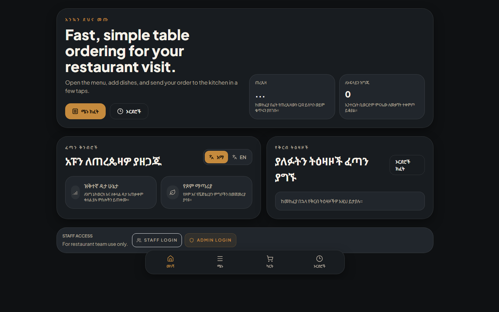
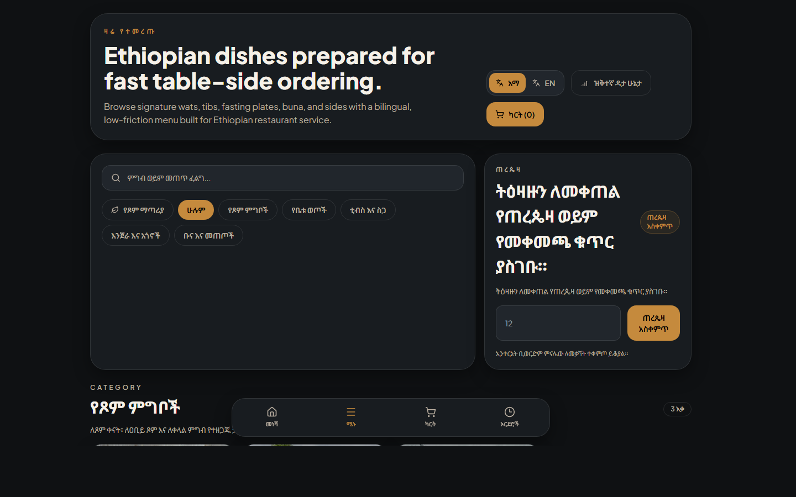
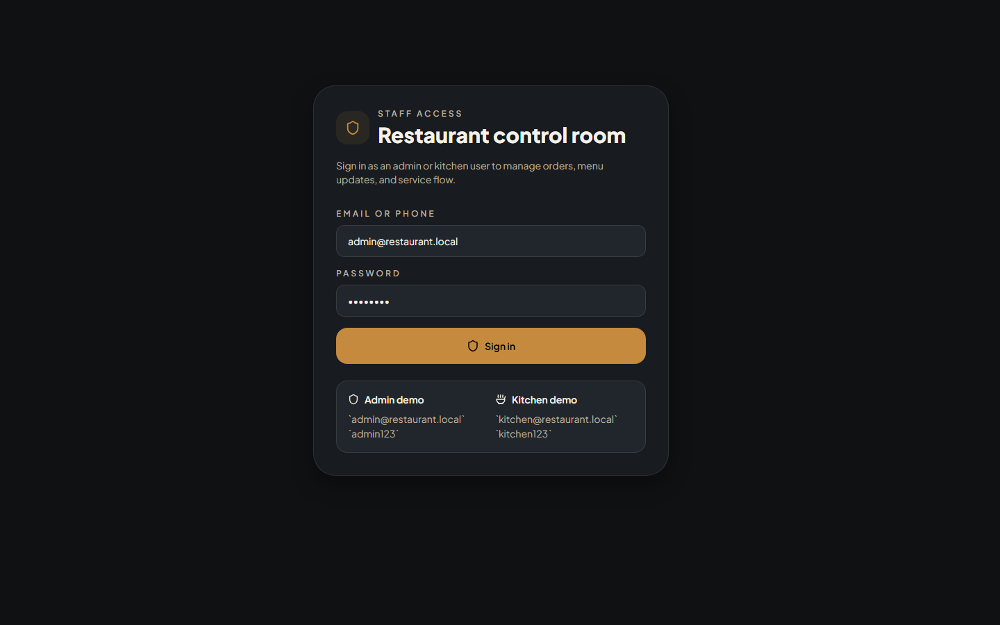

# Ethiopian Restaurant Menu & Ordering System

## Project Description

This is a production-ready full-stack web application for Ethiopian restaurants, featuring:

- Customer ordering flow (QR/table-first)
- Real-time kitchen workflow
- Admin menu/order/payment management
- MySQL + Prisma backend
- Mobile-first React frontend

This project is optimized for local restaurant operations in Ethiopia, including bilingual menu fields (Amharic + English), ETB pricing, cash-first ordering, and Telebirr/Chapa payment flow scaffolding.

## Screenshots

### Home



### Menu



### Staff Login



## Product Scope

### Customer App

- Browse menu by category
- Add to cart and place order
- Track order status live
- Offline-friendly browsing and queued sync support

### Staff App

- `ADMIN`: dashboard, menu CRUD, order management, payment visibility, QR table links
- `KITCHEN`: focused preparation board with status transitions

## Architecture

### Frontend

- React 19 + Vite
- Tailwind CSS
- React Router
- Zustand
- Socket.IO client

### Backend

- Node.js + Express
- Prisma ORM
- MySQL/MariaDB
- JWT auth (`Bearer` token)
- Socket.IO server

### Data

- MySQL schema managed from Prisma
- Bilingual category/item fields (`name_en`, `name_am`, etc.)
- Role-based users (`CUSTOMER`, `KITCHEN`, `ADMIN`)

## Repository Structure

```txt
Restaurant-Menu/
├── client/                    # React frontend (customer + staff routes)
│   ├── src/
│   │   ├── pages/Customer
│   │   ├── pages/Admin
│   │   ├── components/common
│   │   ├── components/admin
│   │   └── lib
│   └── package.json
├── server/                    # Express API + Prisma
│   ├── prisma/
│   │   ├── schema.prisma
│   │   └── seed.js
│   ├── routes/
│   ├── middleware/
│   ├── scripts/
│   └── package.json
└── README.md
```

## Prerequisites

- Node.js 18+ (recommended 20+)
- npm 9+
- MySQL or MariaDB running locally or remotely

## Environment Variables

### Backend (`server/.env`)

Required:

- `DATABASE_URL` (MySQL connection string)
- `JWT_SECRET`

Common:

- `PORT` (default `5000`)
- `FRONTEND_URL` (default `http://localhost:5173`)

Payments:

- `CHAPA_SECRET_KEY` (optional for real gateway integration)
- `TELEBIRR_KEY` (optional for real gateway integration)
- `PAYMENT_WEBHOOK_SECRET` (optional for webhook signature checks)

Seeding / bootstrap accounts:

- `ADMIN_EMAIL`
- `ADMIN_PHONE`
- `ADMIN_PASSWORD`
- `ADMIN_USERNAME`
- `KITCHEN_EMAIL`
- `KITCHEN_PHONE`
- `KITCHEN_PASSWORD`
- `KITCHEN_USERNAME`

### Frontend (`client/.env`)

- `VITE_API_BASE_URL` (default `http://localhost:5000/api`)
- `VITE_SOCKET_URL` (optional, socket URL is auto-derived from API base in current client logic)

## Local Development Setup

### 1. Install Dependencies

```bash
cd server && npm install
cd ../client && npm install
```

### 2. Configure Environment Files

Copy example files and adjust values:

```bash
cd server
cp .env.example .env

cd ../client
cp .env.example .env
```

PowerShell alternative:

```powershell
Copy-Item server\.env.example server\.env
Copy-Item client\.env.example client\.env
```

### 3. Push Prisma Schema to MySQL

```bash
cd server
npm run prisma:generate
npx prisma db push --accept-data-loss
```

### 4. Seed Initial Data

```bash
cd server
npm run seed
```

This seeds:

- Ethiopian categories and menu items
- Admin and kitchen users
- Table records

### 5. Run Both Apps

Terminal 1:

```bash
cd server
npm run dev
```

Terminal 2:

```bash
cd client
npm run dev
```

Open: `http://localhost:5173`

## Seeded Staff Logins

- Admin: `admin@restaurant.local` / `admin123`
- Kitchen: `kitchen@restaurant.local` / `kitchen123`

## Client Routes

### Customer

- `/`
- `/menu`
- `/order` (cart/checkout)
- `/orders`
- `/orders/:orderId`
- `/payment/:txRef`
- `/table/:tableNum` (QR/table redirect)

### Staff

- `/staff/login`
- `/admin/*` (`ADMIN` only)
- `/kitchen` (`ADMIN` or `KITCHEN`)

## API Reference

Base URL: `/api`

### Health

- `GET /health`

### Auth

- `POST /auth/register`
- `POST /auth/login`
- `GET /auth/me`

### Menu

- `GET /menu` (public customer menu)
- `GET /menu/categories` (public category list)
- `GET /menu/admin` (`ADMIN`)
- `POST /menu/categories` (`ADMIN`)
- `PATCH /menu/categories/:id` (`ADMIN`)
- `DELETE /menu/categories/:id` (`ADMIN`)
- `POST /menu/items` (`ADMIN`)
- `PATCH /menu/items/:id` (`ADMIN`)
- `DELETE /menu/items/:id` (`ADMIN`)

### Orders

- `POST /orders` (public customer checkout)
- `GET /orders/:id` (public tracking by id/order number)
- `GET /orders/my?phone=...` (public by customer phone)
- `GET /orders` (`ADMIN`, `KITCHEN`)
- `GET /orders/summary` (`ADMIN`)
- `PATCH /orders/:id/status` (`ADMIN`, `KITCHEN`)
- `PATCH /orders/:id/payment-status` (`ADMIN`)

### Payments

- `POST /payments/chapa/initialize`

- `POST /payments/telebirr/initialize`
- `POST /payments/initiate` (generic)
- `POST /payments/mock/complete` (development helper)
- `POST /payments/chapa/webhook`
- `POST /payments/telebirr/webhook`
- `GET /payments` (`ADMIN`)
- `GET /payments/tx/:txRef`

## Socket Events

Server emits real-time events for dashboard and customer tracking:

- `orderPlaced`
- `statusUpdated`
- `orderUpdated`
- `orderStatusUpdate:<orderId>`
- `paymentUpdated`

## Deployment (Railway + Vercel)

### Railway (Backend)

- Set service root to `server`
- Start command: `npm start`
- Required variables:
  - `DATABASE_URL`
  - `JWT_SECRET`
  - `FRONTEND_URL` (your Vercel app URL, comma-separated if multiple domains)

### Vercel (Frontend)

- Set project root to `client`
- Build command: `npm run build`
- Output directory: `dist`
- SPA routing is handled by `client/vercel.json` rewrite to `index.html` (so `/menu`, `/order`, etc. resolve correctly on refresh/direct hit)
- Required variable:
  - `VITE_API_BASE_URL=https://<railway-domain>/api`

### CORS origin note

The backend normalizes origins by trimming trailing `/` so values such as
`https://restaurant-menu-beta-eight.vercel.app/` and
`https://restaurant-menu-beta-eight.vercel.app` are treated the same.

## GitHub Actions automation

This repository includes `.github/workflows/ci-cd.yml` that:

1. Installs dependencies for `server` and `client`
2. Validates Prisma schema (`npx prisma validate`)
3. Builds the client (`npm run build`)
4. On push to `main`, optionally triggers deploy hooks if these GitHub secrets are set:
   - `RAILWAY_DEPLOY_HOOK_URL`
   - `VERCEL_DEPLOY_HOOK_URL`

## Available Scripts

### Backend (`server/package.json`)

- `npm run dev` - start API with nodemon
- `npm run start` - start API with node
- `npm run prisma:generate` - generate Prisma client
- `npm run prisma:migrate` - Prisma migrate dev
- `npm run prisma:seed` - Prisma seed command
- `npm run seed` - run custom seed script
- `npm run create-admin` - upsert admin account
- `npm run test-db` - test database connectivity

### Frontend (`client/package.json`)

- `npm run dev` - start Vite dev server
- `npm run build` - production build
- `npm run preview` - preview production build

## Deployment Notes

Typical split deployment:

- Frontend: Vercel / Netlify
- Backend: Render / Railway / VM
- Database: Managed MySQL or MariaDB

Make sure:

- `FRONTEND_URL` includes production frontend domain in backend env
- CORS is configured for all allowed origins
- `JWT_SECRET` is strong and unique per environment
- HTTPS is enabled for both frontend and backend

## Security Notes

- JWT auth uses `Authorization: Bearer <token>`
- Role checks enforced server-side for admin/kitchen routes
- Passwords are hashed with `bcryptjs`
- Webhook signature support available via `PAYMENT_WEBHOOK_SECRET`

## Troubleshooting

### Prisma client/module errors

Run:

```bash
cd server
npm run prisma:generate
```

### Schema mismatch with DB

Run:

```bash
cd server
npx prisma db push --accept-data-loss
```

### Missing initial users/menu

Run:

```bash
cd server
npm run seed
```

### CORS issues in browser

Verify backend `FRONTEND_URL` includes your frontend origin.

## Current Payment Status

Payment routes are production-shaped but currently safe for development-first integration:

- Chapa and Telebirr initialization endpoints are present
- Webhook endpoints are present
- `mock/complete` endpoint supports local payment simulation

## License

This project is currently private/internal unless a license is added by the repository owner.
